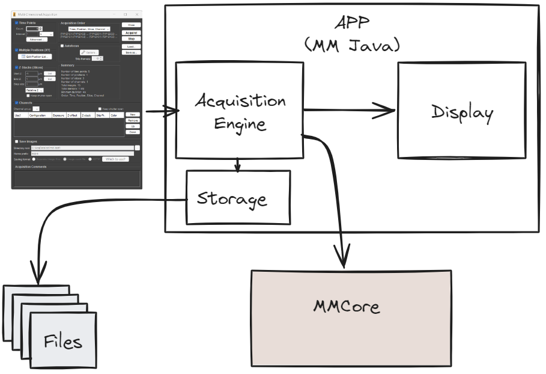
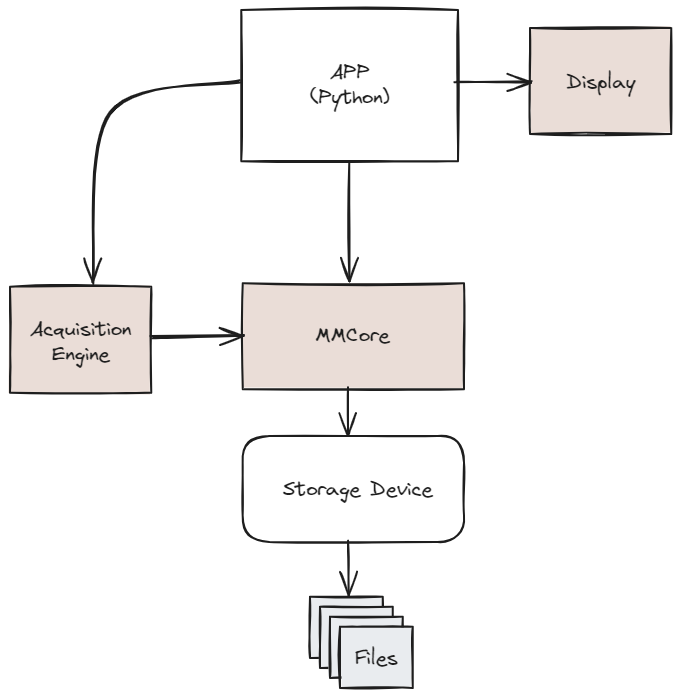
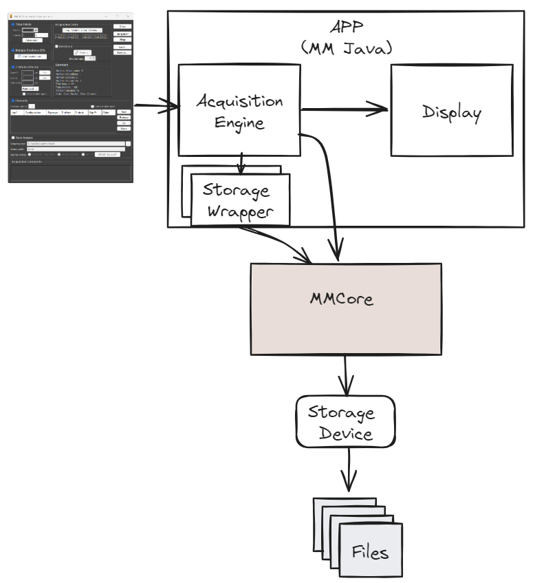

# Storage Device for Micro-manager

## Conceptual Block Diagram of the Existing MM Java App


## Conceptual Block Diagram of the New Python App


The drawing shows the Python application as the controlling process, but it can be used in any language supported by the available MMCore wrappers.

## Conceptual Block Diagram of the New MM Java App



## MMCore API
We propose to extend the MMCore API to accommodate the new "Storage" device. All code is in pseudo C++ (without unnecessary type decorations) to improve readability. Errors are handled through exceptions (not shown).

There are three essential points about this API:
- allows the acquisition engine or controlling script to be *outside* of MMCore. 
- all storage functions and any access to the File System are hidden behind the MMCore API, and images do not need to cross the API
- The MMCore is using StorageDevice - a new type of MMDevice that handles the reading and writing of datasets. That way, it is easy to add new file formats as new devices (e.g., the same principle as adding a new camera).

The proposed API only illustrates the principle and may need additional methods to be fully functional. This API assumes that only one storage device is active in MMCore at one time, and all API calls implicitly refer to the active device.

### Get Storage Device
```
string getStorageDevice();
```

### Set Storage Device
```
void setStorageDevice(string deviceName);
```

### Create Dataset
``` 
string acqCreateDataset(string path, string name, int numberOfDimensions, string customMeta);
```
Create a new dataset. If the resulting path exists, this method will fail. The number of dimensions must be specified at the time of creation, and the call will fail if the current storage device does not support the requested dimensionality.

**acqCreateDataset()** returns the string handle (UUID) to the opened dataset. This handle is subsequently used in all other API calls to refer to that dataset. We can open multiple datasets at the same time.

### Configure Dimensions
We can *optionally* configure each dimension with a name and physical meaning.
```
void configureDimension(string handle, int dimension, string name, string meaning);
```
- handle: dataset handle
- dimension: integer pointing to the dimension we are configuring
- name: name we want to assign to a dimension, e.g. "slice" or "channel"
- meaning: physical meaning of the dimension using a commonly adopted (OME?) terminology, e.g., Z, C, T, etc.


### Close Dataset
We call this method to prevent further accidental changes when the acquisition is complete.

``` 
bool acqCloseDataset(string handle);
```
After the dataset is closed, we can't add any images.

### Load Dataset
This method allows us to load an existing dataset and access data through the MMCore API. Loaded datasets are immutable; any attempt to add images will fail. "Loading" the dataset does not necessarily mean it resides in program memory—it just means we can access it through the MMCore API.

```
string acqLoadDataset(string path, string name);
```

### Delete Dataset
We can delete any dataset for which we have a valid handle.
```
void acqDeleteDataset(string handle);
```

### List Datasets
Lists all datasets in the given path.
```
vector<string> acqListDatasets(string path);
```

### Snap and Save
```
void acqSnapAndSave(string handle, int frame, vector<int> coordinates, string imageMeta);
```
Performs a single image acquisition and sends the image to the Storage device. Metadata is optional, as the mandatory meta will be auto-generated. The size of the coordinate array must match the previously declared number of dimensions. The image does not leave the MMCore, as the image buffer is piped directly to the Storage Device immediately after the acquisition. After sending the image to the storage, we can still fetch the acquired image and send it to the display if we want to by using the existing getImage() call.

### Pop and Save
```
void acqPopNextAndSave(string handle, vector<int> coordinates, string imageMeta);
```
Pops the next available image from the queue and sends it to the Storage device. Metadata is optional, as the mandatory meta will be auto-generated. Displaying images during sequence acquisition is now more challenging than before, as the popped image is removed from the queue. The problem can be solved by additional caching of the latest popped image inside the MMCore.

### Add external image
```
void acqAddImage(string handle, vector<int> coordinates, string imageMeta);
```
We allow the application to insert an image into the storage to support old-style acquisition where the image makes the round-trip through the GUI. We can also utilize this mode to process images at the application level before adding them to the dataset.

### Access to the data
```
string acqGetSummaryMeta(string handle);
string acqGetImageMeta(string handle, vector<int> coordinates);
vector<unsigned char> acqGetImagePixels(string handle, vector<int> coordinates);
```

## Storage Device API
We will determine the Storage Device API after the MMCore API is complete. The device API will mostly mirror the MMCore API, plus some calls for internal use to insert pixel data. MMCore must treat the storage device appropriately to provide efficient data transfers behind the API.

Storage Device API is not visible to the application (user-client), so we will treat it as an MMCore implementation detail.


